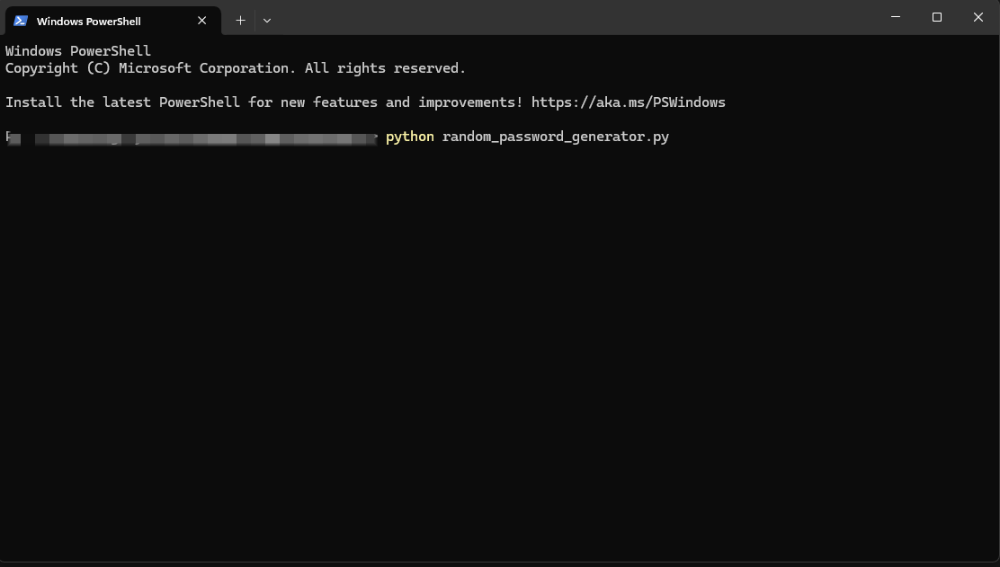

# Random Password Generator


[](https://www.python.org/)

A lightweight and secure **random password generator** built using Python.  
Easily create strong passwords of customizable lengths using a mix of uppercase, lowercase, digits, and special characters.

---

##  Features

- Uses `secrets` (not `random`) for cryptographically secure password generation
- Customizable password length and character types
- Built-in password strength analysis with:
  - Length evaluation
  - Character diversity (upper, lower, digits, symbols)
  - Repetition and pattern detection
  - Entropy estimation
- Command-line interface
- Optionally saves passwords to a `.txt` file

---

##  Usage

1. **Clone the repository:**
   ```bash
   git clone https://github.com/rocky190295/Random-Password-Generator.git
   cd Random-Password-Generator
2. **Create a virtual environment** (Optional)
   ```bash
   python -m venv venv
   venv\scripts\activate # On Linux source venv/bin/activate
3. Run the script
   ```bash
   python random_password_generator.py

## Screenshot


## How it Works
The script uses:
- `secrets` module - for cryptographically secure random values
- `string` module - to access character sets (letters, digits, symbols)

## License
The project is licensed under the MIT Licence.

## Author
Made with ❤️ by Rakshit

## Star this Repo
If you find this project useful or educational, please consider giving it a ⭐️ on GitHub!
  